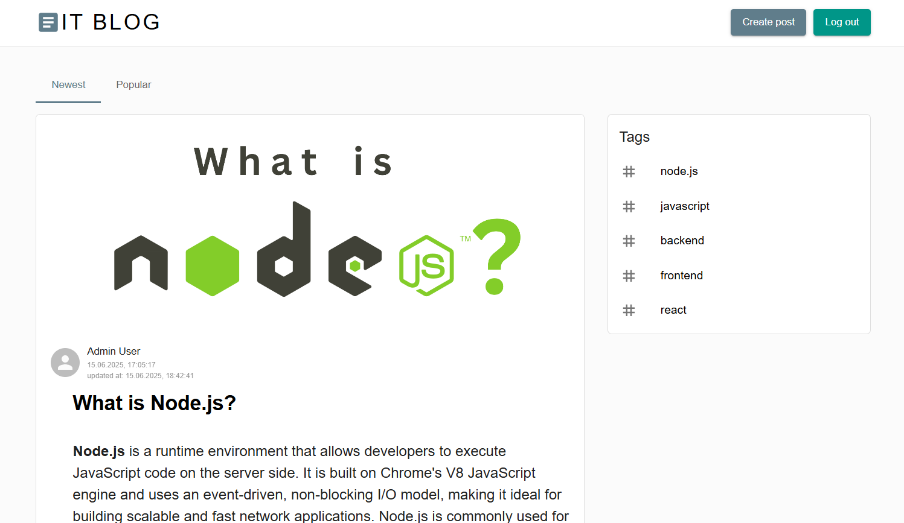

# Blog

Frontend for the full-stack blog app built with React.

[README на русском](./README.ru.md)

[Backend API](https://github.com/TatyanaZakiryanova/blog-backend-prisma)

## Deployment

[Deploy](https://blogaboutit.netlify.app/)



## Technologies

- **Typescript**
- **React**
- **Redux Toolkit**
- **Material UI, Sass**
- **React Hook Form**
- **React-SimpleMDE Editor**
- **ESLint, Prettier**

## Features

- Registration and authentication
- Creating, editing, and deleting posts
- Post creation form with **React-SimpleMDE Editor**
- **Uploading images** for posts
- Adding, editing, and deleting comments
- Searching posts by tags

## More details

### Routing

- Pages:
  - Home
  - Full post (/posts/:id)
  - Registration (/registration)
  - Login (/login)
  - Create post (/posts/create)
  - Edit post (/posts/:id/edit)
  - Search posts by tag (/tag/:tag)

### State Management

- **createAsyncThunk** for API requests
- **Redux slices** for auth, posts, comments, and tags

### Loading & Error Handling

- Skeletons shown while loading posts and tags
- Alerts shown on errors: login, registration, image upload, post creation

### Form Validation

- Form validation with **React Hook Form**
- Registration form requires:
  - Name
  - Email (must be valid format)
  - Password (minimum 5 characters)
- All fields are required
- Submit button is disabled if fields are invalid

### Styling and Responsiveness

- Fully responsive layout down to 360px screen width

## How to start project

in the project directory enter:

```bash
npm install
```

and then run in dev mode:

```bash
npm run dev
```

build the project:

```bash
npm run build
```

production mode:

```bash
npm run preview
```
