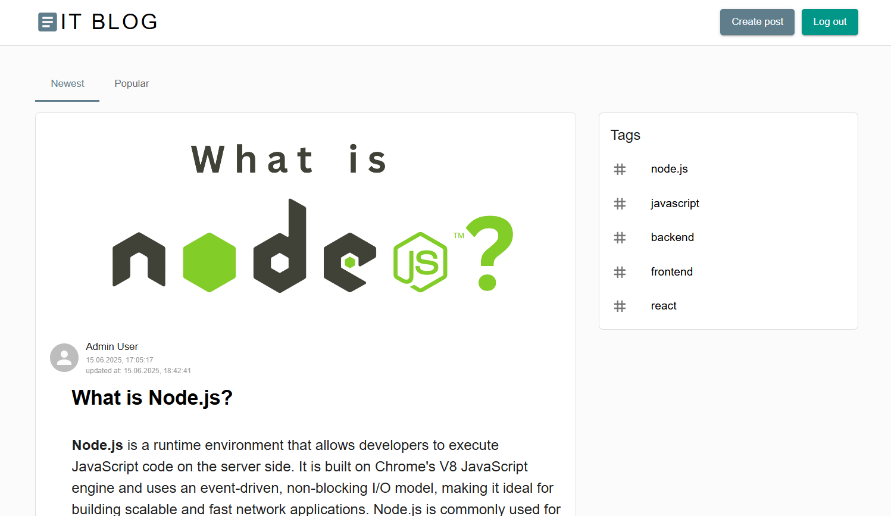

# Blog

Frontend для full-stack блога на React.

[Backend API](https://github.com/TatyanaZakiryanova/blog-backend)

## Deployment

[Deploy](https://blogaboutit.netlify.app/)



## Technologies

- **Typescript**
- **React**
- **Redux Toolkit**
- **Material UI, Sass**
- **React Hook Form**
- **React-SimpleMDE Editor**
- **ESLint, Prettier**

## Features

- Регистрация и авторизация
- Создание, редактирование и удаление постов
- Форма для создания поста - **React-SimpleMDE Editor**
- **Загрузка изображений** к постам, **загрузка аватара пользователя**
- Добавление, редактирование и удаление комментариев к постам
- Поиск постов по тегам

## More details

### Token handling

**Access tokens хранятся в localStorage** и прикрепляются к каждому запросу через **axios interceptor**.

Если запрос возвращает **ошибку 401 Unauthorized** (обычно из-за истекшего срока действия access token), то axios interceptor:

- Отправляет POST запрос на **/auth/refresh-token**, используя refreshToken, сохраненный в **безопасном httpOnly cookie**.
- Если обновление прошло успешно, новый токен доступа **сохраняется в localStorage**, а исходный запрос автоматически повторяется с новым токеном.
- `originalRequest._retry = true` позволяет избежать повторного обновления токена для одного запроса.

### Routing

- Страницы:
  - Главная
  - Полный пост (/posts/:id)
  - Регистрация (/registration)
  - Авторизация (/login)
  - Создание поста (/posts/create)
  - Редактирование поста (/posts/:id/edit)
  - Поиск постов по тегу (/tag/:tag)

### State Management

- **createAsyncThunk** для запросов к API
- **Redux slices** для состояний авторизации, постов, комментариев, тегов

### Loading & Error Handling

- Скелетоны при загрузке постов и блока тегов
- Alerts при ошибках авторизации, регистрации, загрузки изображений, создания постов

### Form Validation

- Валидация форм регистрации и авторизации с React-Hook-Form
- В форме регистрации обязательны:
  - Имя
  - Почта (должна соответствовать формату)
  - Пароль (минимум 5 символов)
- Все поля обязательны для заполнения
- Есть возможность загрузки аватара пользователя
- Кнопка submit отключена при некорректном заполнении полей

### Styling and Responsiveness

- Адаптивная вёрстка до 360px ширины экрана

## How to start project

in the project directory enter:

```bash
npm install
```

and then run in dev mode:

```bash
npm run dev
```

build the project:

```bash
npm run build
```

production mode:

```bash
npm run preview
```
